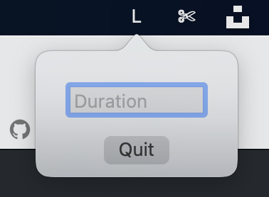
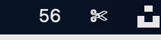
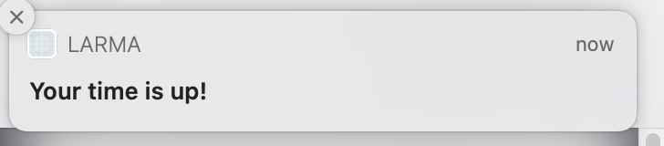

#  Larma
There is no way I am paying $5 for a timer app, so I wrote my own. It lives in your menu bar and saves you having to go to google each time. In the same spirit, I am not publishing this app anywhere, but you can easily build and run it yourself through xcode.

## Usage
1) Open project with xcode
2) Build project
3) Click `Products` in your file browser, select "Larma.app", right click-> show in finder
4) Copy that file to your `Applications` directory
5) (Optional) Go to  `Users & Groups` under system preferences and add as a startup app.

